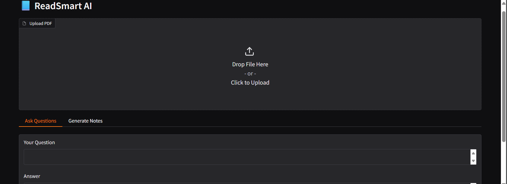
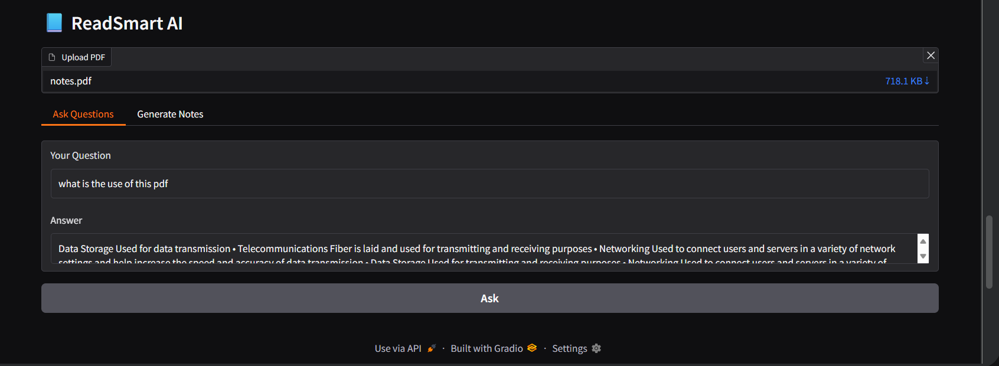
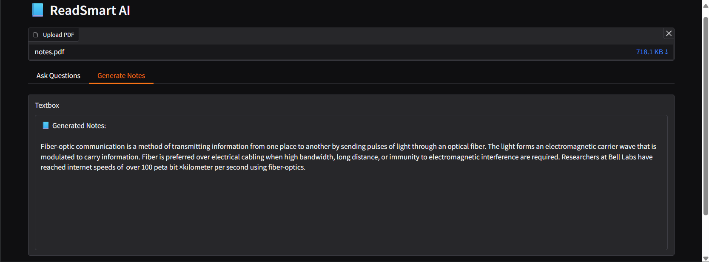

# ReadSmart AI 
(ReadSmart AI is a secure, privacy-first AI application that allows students to chat with PDF study materials and generate concise study notes using modern NLP and Transformer models.)

Unlike many AI tools, this project runs entirely locally using open-source models.
* No external APIs
* No API keys
* No data leaves the session

# Key Features

# 100% Privacy-First
Runs fully on local Hugging Face models. Uploaded documents are never sent to external servers.

# Chat with PDFs
Ask context-aware questions and get accurate answers from your study materials.

# Automatic Note Generation
Generate concise summaries for quick revision and exam preparation.

# Free & Unlimited
No API costs, no rate limits, no key management.

# Tech Stack
Python 3.10+
Gradio – Interactive web interface
Transformers (Hugging Face)
google/flan-t5-base – Question answering
facebook/bart-large-cnn – Summarization
Sentence Transformers – Semantic embeddings
FAISS – Vector similarity search
PyPDF – PDF text extraction
NumPy

# Installation & Setup
 *Google Colab (Recommended)
 *Create a new cell and run:
 (!pip install gradio pypdf faiss-cpu sentence-transformers transformers numpy)

▶️ How to Run

Install dependencies using the command above

Copy the app.py code into a cell or script

Run the program

Open the Gradio public link

Upload a PDF and start interacting

# How It Works (Under the Hood)

PDF Ingestion
Extracts text from uploaded PDFs using PyPDF.

Embedding Generation
Converts text chunks into vector embeddings using Sentence Transformers.

Semantic Retrieval (RAG)
FAISS retrieves the most relevant text chunks for a given query.

Answer Generation
FLAN-T5 generates answers based on retrieved context.

Summarization
BART produces concise study notes from document content.

#output Screenshots (Optional)
 (Readsmart_AI home)
 
 (ask_qustions feature)
  
 (generate feature)
  

# Why This Project?

Demonstrates core NLP fundamentals
Avoids fragile dependencies and API keys
Shows hands-on understanding of:
Embeddings
Vector databases
Retrieval-Augmented Generation (RAG)
Transformer models
Suitable for internships, placements, and academic evaluation

# Future Improvements

Download notes as PDF
Support multiple PDFs
Add conversational memory
Deploy on Hugging Face Spaces

#Author
parameshwar d
B.Sc Artificial Intelligence & Machine Learning
